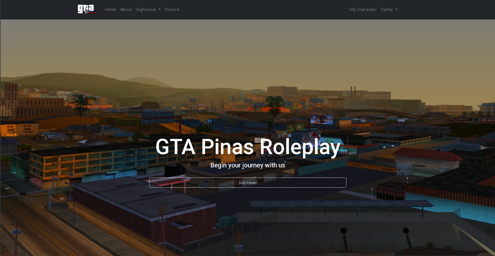

# GTA Pinas Website

(20/05/24 update) - **This project was transferred to Laravel Framework & different repository.**

**Please be advised that this project is under GNU General Public License, make sure to give where credit is due when copying or re-distributing this project.**

----

This is a project, currently being worked on and active. (Active Website @ http://renegadecommunity.xyz/)

This is a User Control Panel website made for GTA Pinas (Renegade Community), a game server in San Andreas Multiplayer.

**You may view the code of this project, to gather ideas on how to make a proper functioning User Control Panel.**

**Configuration for the database has been intentionally stripped out due to legal reasons, configure your own database.**

----

# Demo Account:

* Username/Email: test_account (or sample@renegadecommunity.xyz)
* Password: testrenegade123

----

### This is purely coded in Vanilla PHP for the back-end. While the front-end design is aided by the Bootstrap Framework and Standard CSS.
### The website's database is ran on MySQL (XAMPP) / PhpMyAdmin.

#### This project is done by solely by me, with ideas from aezakmi (Adrian).

---

# Screenshots

Homepage

My Characters (no characters owned)

My Characters (with characters owned)
